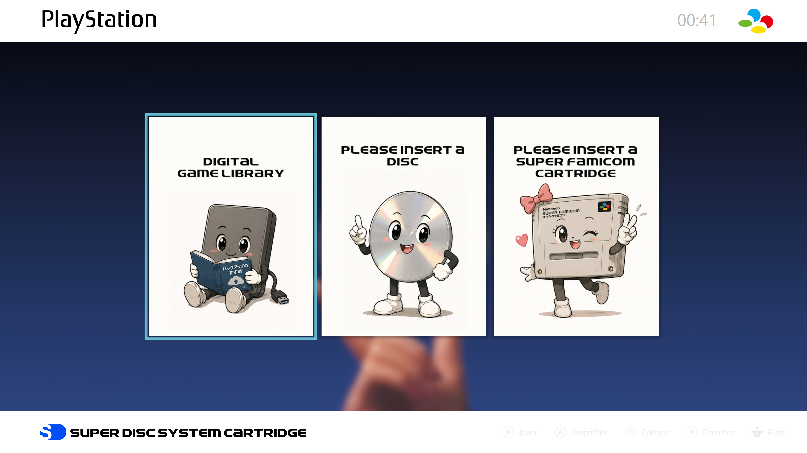
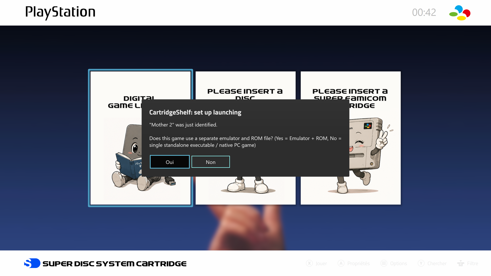
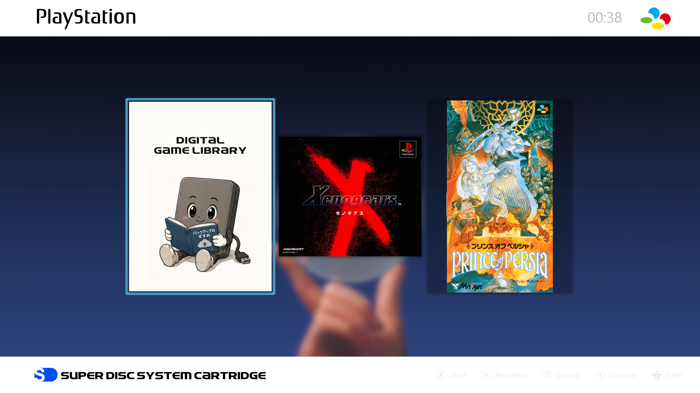
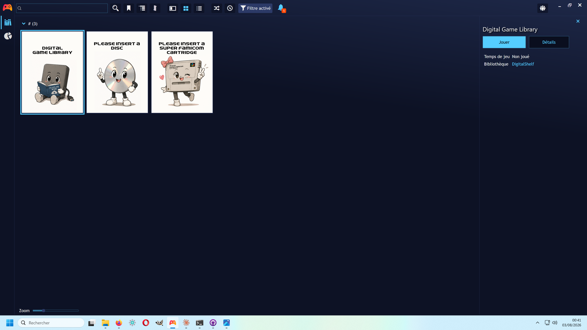

# Playnite Physical Media Extensions

Three Playnite extensions that let you plug in real physical game media —
an SNES cartridge or an optical disc — and have Playnite automatically
identify the game, fetch its cover art, and launch the right emulator.
No manual entry, no OCR.

| Extension | What it does | Hardware required |
|---|---|---|
| **CartridgeShelf** | Identifies SNES cartridges | [Epilogue SN Operator](https://www.epilogue.co/) (USB cartridge reader) |
| **DiscShelf** | Identifies PS1 / PS2 / Saturn / Dreamcast / Mega-CD / Neo Geo CD discs | A regular optical drive |
| **DigitalShelf** | Adds a third "digital library" tile alongside the two above, with a Fullscreen-mode transition | None (pure UI extension) |

Each extension works independently — you don't need all three.

---

## Screenshots

<p align="center">
  <br>
  <em>Digital, disc, and cartridge shelves side by side in Fullscreen mode</em>
</p>

<p align="center">
  <br>
  <em>DigitalShelf's library tile, sitting next to the physical-media slot</em>
</p>

<p align="center">
  <br>
  <em>First-run prompt: choose Emulator + ROM, or a standalone executable</em>
</p>

<p align="center">
  <br>
  <em>DiscShelf and CartridgeShelf showing an identified game, ready to launch</em>
</p>

<p align="center">
  <br>
  <em>Desktop mode: the game entry with its DigitalShelf library tag</em>
</p>

---

## How it works

- **CartridgeShelf** talks to the SN Operator over a virtual serial port
  (no special driver needed — Windows handles this natively) and reads a
  small identification record from the cartridge as soon as it's inserted.
  That record is matched against a bundled database (`Snes.csv`) to get
  the game's title; unrecognized cartridges prompt you once for a name,
  which is then remembered.
- **DiscShelf** polls the optical drive and reads the disc's low-level
  filesystem metadata (`SYSTEM.CNF` for PS1, `PARAM.SFO` for PS2, etc.) to
  identify the exact game without needing to mount or rip anything.
- Both then fetch cover art (ScreenScraper, with SteamGridDB and
  libretro-thumbnails as fallbacks) and create a single "now playing" slot
  in your Playnite library, with a launch action pointing at the emulator
  and ROM/ISO you configure.
- **DigitalShelf** doesn't do detection — it manages the view/transition
  layer so your digital library sits next to the physical-media slot as a
  separate, switchable tile.

---

## Installation

### Recommended: Playnite add-on browser
Once these extensions are listed in the [official Playnite add-on
database](https://github.com/JosefNemec/PlayniteAddonDatabase), you can
install them directly from Playnite: **Menu → Add-on browser**, search
for the extension name, install.

### Manual install
Download the `.pext` file for the extension(s) you want from the
[latest release](https://github.com/penpenlovesrei-dotcom/Playnite-physical-cartridge-disc/releases/latest),
then drag-and-drop it onto the Playnite window (or double-click it).

---

## Setup after installing

### CartridgeShelf
1. Plug in the SN Operator. **Close Epilogue Playback** if it's running —
   only one application can talk to the device's serial port at a time.
2. Insert a cartridge. If it's not in the bundled database, Playnite will
   ask for the game's name and region.
3. To enable launching, when a recognized cartridge is inserted for the
   first time you'll be prompted to pick an emulator and a ROM file (or a
   single standalone executable, for recompiled/homebrew builds).
4. Optional: add your own [ScreenScraper](https://www.screenscraper.fr/)
   and/or [SteamGridDB](https://www.steamgriddb.com/profile/preferences/api)
   API credentials in the extension's data folder for better cover art —
   see `ScreenScraperCredentials.csv` / `SteamGridDbCredentials.csv`
   templates.

> **Note on Epilogue Playback:** CartridgeShelf releases and re-opens the
> serial port on every poll cycle (roughly once a second) specifically so
> it can coexist with Playback. If both are running and you see an
> occasional missed detection, that's expected — it just retries.

### DiscShelf
1. Insert a disc in your optical drive.
2. Same first-run flow as CartridgeShelf: unknown discs prompt for a
   name/region, first launch of a recognized game prompts for an emulator
   and ISO (or a standalone executable).

### DigitalShelf
Designed to run alongside the Fullscreen theme. It reads two plain-text
config files sitting next to the extension for easy tweaking without
recompiling:
- `mosaic_enabled.txt` — delete/rename this file to disable the transition
  effect entirely.
- `sounds.txt` — maps sound events to `.wav` files inside your active
  Fullscreen theme's `audio` folder.

> DigitalShelf's transition and sound integration were built against a
> custom Fullscreen theme. If you're using a different theme, the visual
> effect and sounds may not line up perfectly out of the box — the config
> files above are the place to adjust that.

---

## Known limitations

- CartridgeShelf and DiscShelf each manage a single "now playing" slot —
  they don't build a persistent library of every cartridge/disc you own,
  just what's currently inserted. Games you've already named/configured
  are remembered (see `UserSnesAdditions.csv` / `UserLibrary.csv` in the
  extension's data folder), so re-inserting a known cartridge or disc
  works instantly.
- Region field is currently used for cover-art matching only (SNES
  cartridges are matched against the Japanese release by default).

---

## Repository structure

```
CartridgeShelf/   Source for the CartridgeShelf plugin
DiscShelf/        Source for the DiscShelf plugin
DigitalShelf/      Source for the DigitalShelf plugin
manifests/        Installer manifests (used by Playnite's add-on auto-update)
_release/         Local packaging scripts and output (.pext files), not tracked in git
```

To build from source, open the relevant `.csproj` in Visual Studio
(targets .NET Framework 4.8) and build. `_release/build-release.ps1`
packages all three into distributable `.pext` files via Playnite's
`Toolbox.exe`.

---

## Credits

Built by PenPen, who has no programming background — the entire project
(SN Operator protocol reverse-engineering, all three plugins, packaging,
and this documentation) was built through conversations with
[Claude](https://claude.ai), Anthropic's AI assistant. SN Operator
cartridge-reading protocol reverse-engineered from USB traffic captures —
see the CartridgeShelf source for details. Playnite extension pattern
based on the standard `GenericPlugin` / `GameLibrary` SDK.
